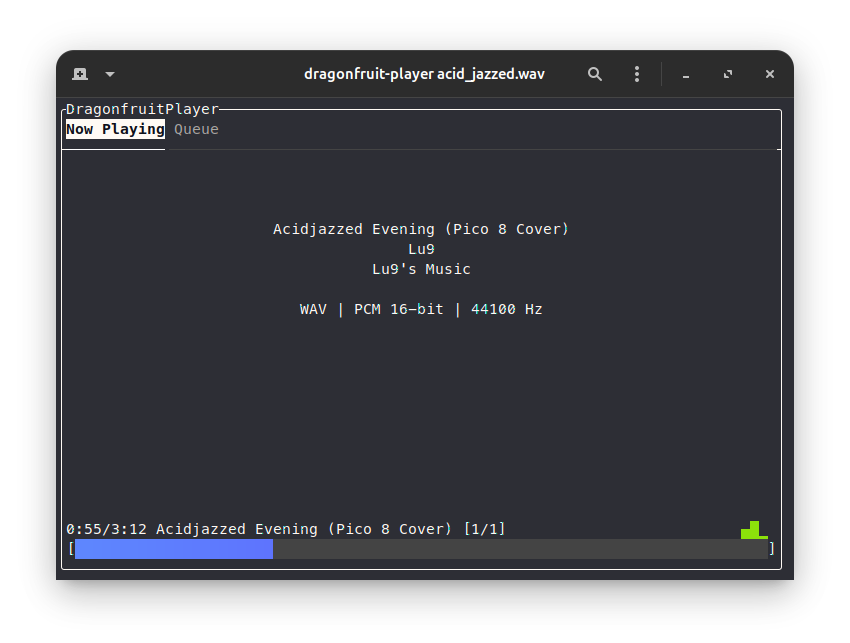

# Dragonfruit

 
  


A CLI music player built using PulseAudio and [FTXUI](https://github.com/ArthurSonzogni/FTXUI).



> [!NOTE]
> The song displayed in the above image is [Acidjazzed Evening (Pico-8 Cover)](https://www.youtube.com/watch?v=4xCEKbbe6WA) by [Lun9](https://www.youtube.com/@Lu9sMusic). Check their stuff out! The original song is Acidjazzed Evening by Janne (Tempest) Suni.

> [!WARNING]
> This project is early into development and is mostly for the learning experience and as a fun side project. The audio engine is built from scratch, and so many codecs will be unsupported/unstable. Currently, only WAV is partially supported.
>
> This isn't the cleanest code I've written. Adjust expectations accordingly.

## Building from source

Prebuilt packages are not available for Dragonfruit. Building the project from source is required.

1. Install necessary dependencies for building:
```bash
apt install build-essential cmake pkg-config libpulse-dev
```

2. Ensure the PulseAudio runtime library is installed:
```bash
apt install libpulse0
```

3. Clone the repository:
```bash
git clone github.com/ShinraiYeen/Dragonfruit
```

4. Build the project:
```bash
cd Dragonfruit
mkdir -p build
cd build
cmake ..
make -j8
```

## Installing
After building the project, Dragonfruit can be installed using the following:
```bash
make install
```

## Usage

### Starting a Song
```bash
dragonfruit-player <path> [<path> ...]
```

Where path is either a `.wav` file or directories containing `.wav` files. Multiple arguments can be used to add multiple songs/directories into the song queue.

### Player Controls
- `TAB` cycles through the available menus. Alternatively, you can click on these menu options with a mouse.
- `Right arrow` skips to the next song.
- `Left arrow` skips to the previous song.
- `Space` pauses the current song.
- `,` seeks backward through the current song.
- `.` seeks forward through the current song.
- `s` shuffles the song queue and restarts from the beginning.

### Lost?
`dragonfruit-player --help` will display a more detailed help page with some usage examples.

## Features
- WAV audio support. Supports most common WAV formats such as PCM 16/24/32-bit and IEEE-Float 32/64-bit.
- Song queues. Multiple songs can be queued up to play in a loop.
- Seeking through, playing, and pausing audio.